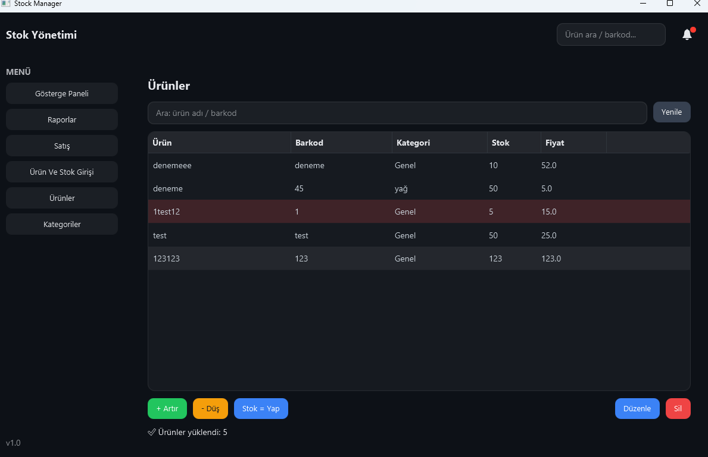
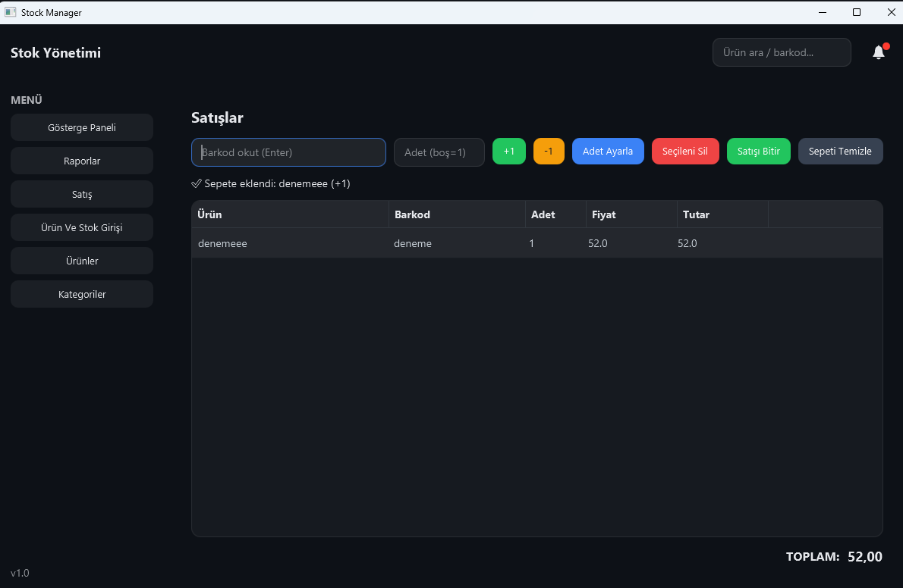
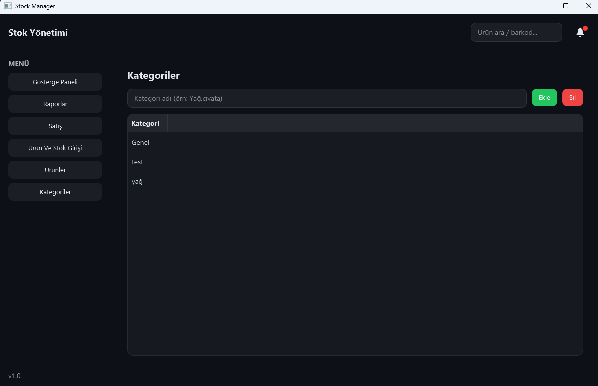
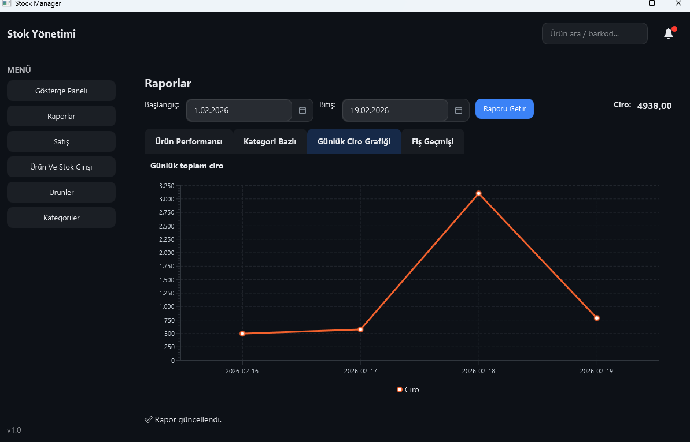
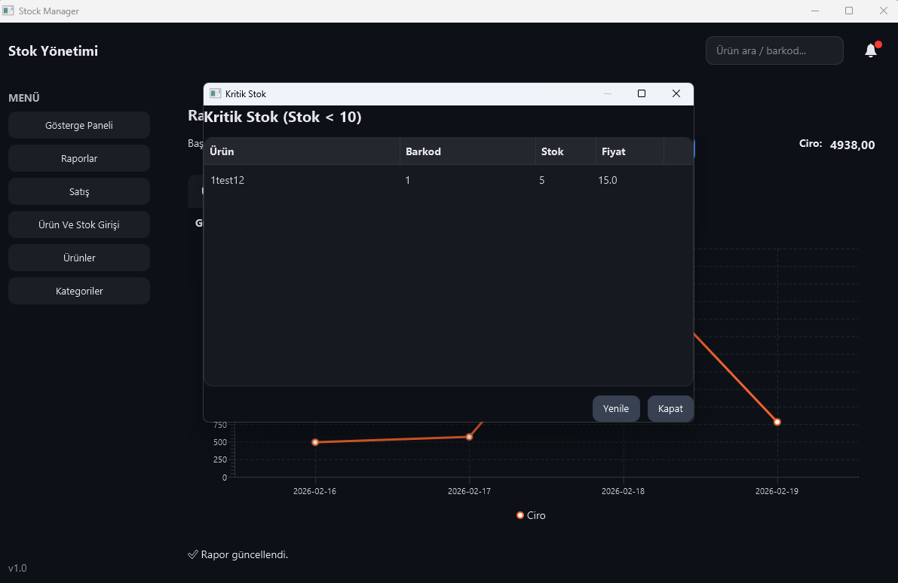

# Stock Manager (JavaFX Desktop Application)

Stock Manager is a **desktop-based stock tracking and sales management application**
developed with **Java 17 + JavaFX**.  
The application uses **PostgreSQL** as its database and is optimized with
**HikariCP connection pooling** for high-performance and stable database access.


---

## ✨ Why This Project Stands Out
- Modern **JavaFX + FXML** based user interface
- Clean and maintainable **DAO architecture**
- **HikariCP** connection pooling for fast and stable database access
- PostgreSQL / **Neon DB compatible**
- **Critical stock alert system**
- Dashboard-focused management experience

---

## 📊 Application Modules

### Dashboard
- Overall stock and sales overview
- Critical stock warnings
- Inventory summary


---

### Products Management
- Add, edit and delete products
- Stock and price management
- Category-based organization



---

### Sales Module
- Cart-based sales workflow
- Quantity handling
- Automatic stock deduction after sales



---

### Categories
- Create and manage product categories
- Product–category relationship handling



---

### Reports
- Sales-based reports
- Product-oriented summaries
- Historical data analysis



---

### Critical Stock Alerts
- Lists products below the critical stock level
- Helps prevent out-of-stock situations



---

## 🛠️ Tech Stack
- **Java 17**
- **JavaFX (FXML, Controls)**
- **PostgreSQL**
- **HikariCP**
- **Maven**
- UI Theme: **Atlantafx**

---

## 🏗️ Architecture Overview

```
JavaFX UI (Controllers)
        ↓
      DAO Layer
        ↓
 PostgreSQL Database
   (HikariCP Pool)
```

---

## 🚀 Running the Application

### Requirements
- Java 17
- Maven
- PostgreSQL (Local or Neon)

### Environment Variables
Database credentials are provided via environment variables:

```
DB_HOST
DB_NAME
DB_USER
DB_PASS
```

Example:
```bash
DB_HOST=localhost
DB_NAME=stockdb
DB_USER=postgres
DB_PASS=postgres
```

### Run Command
```bash
mvn clean javafx:run
```

---

## 🔐 Security Notes
Sensitive information such as database credentials is **not committed** to the repository.
Environment-based configuration is used for security.

---

## 🔮 Future Improvements
- Barcode scanner integration
- Role-based authorization (Admin / User)
- Export reports to PDF / Excel
- Dockerized deployment
